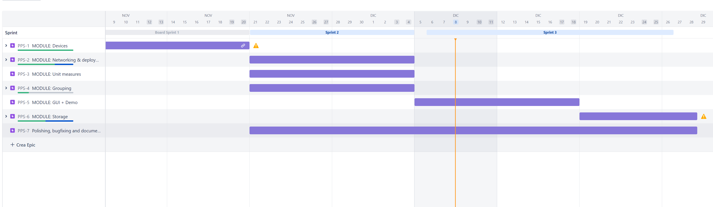
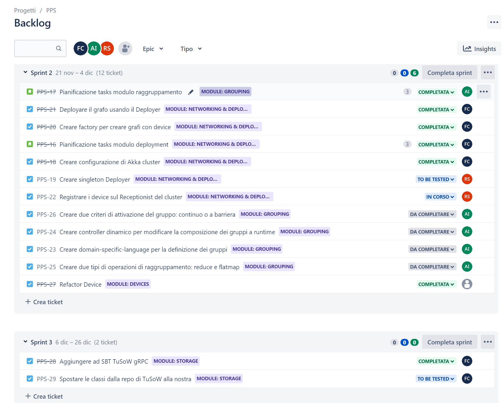
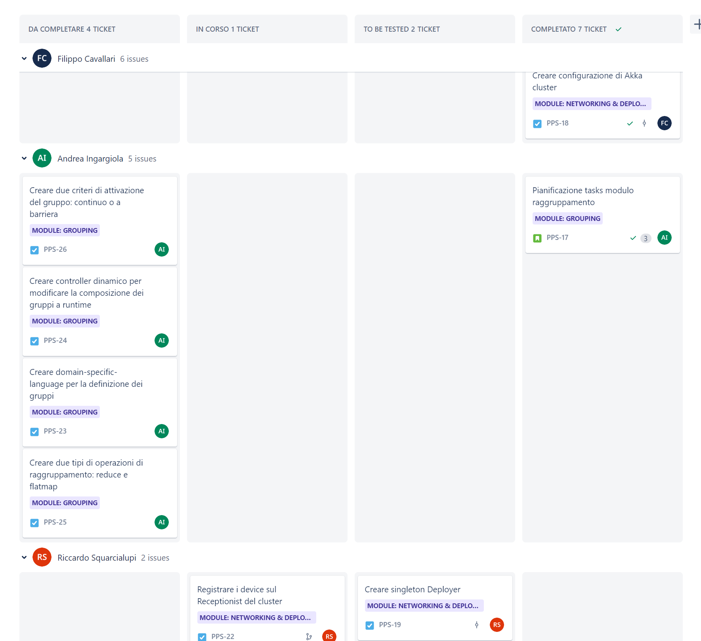

## Processo di sviluppo adottato

Come processo di sviluppo è stato adottato **Scrum**, un framework *agile* per la gestione del ciclo di sviluppo del software, iterativo ed incrementale.
Sono state quindi pianificate tre tipologie di riunioni:
* **Sprint planning**: una riunione dedicata alla pianificazione della sprint successiva, solitamente tenuta ad inizio settimana
* **StandUp meeting**: meeting giornaliero per discutere di quanto è stato svolto e di cosa ci si occuperà in giornata; molto utile per trovare criticità e tenere aggiornato l'intero team sull'avanzamente del lavoro
* **Sprint review**: riunione tenuta al termine di una Sprint per valutare le perfomance del team, cosa ha funzionato e cosa è migliorabile

Le **Sprint** hanno una durata media di due settimane, in cui idealmente nella prima settimana si completa l'implementazione e nella seconda si effettuano *test*, *code review* e *polishing*.

Come strumento di gestione delle Sprint abbiamo utilizzato **Jira**, un software sviluppato dall'Atlassian (la stessa che sviluppa Confluence e Bitbucket) che offre avanzati strumenti di project management per team *agile*.

Sono stati utilizzati quattro tipi di ticket:
* **Task**: il ticket principalmente più utilizzato e che identifica un risultato da implementare/realizzare;
* **Story**: a livello pratico è identico al task ma concettualmente indica un risultato da raggiungere dal punto di vista del cliente o ad un livello di astrazione più alto (e.g. pianificazione di un componente);
* **Bug**: ticket utilizzato per il bug-tracking;
* **Epic**: è un ticket utilizzato per raggruppare più task/story e definire limiti temporali (e.g. diagramma di Gantt); è stata utilizzata per raggruppare i vari ticket in base ai moduli di appartenza e stimare il tempo necessario per la realizzazione del progetto.

I ticket vengono creati, assegnati e gestiti dal **product backlog**, uno degli artefatti del framework Scrum.

Sempre dal *backlog* è possibile definire ed avviare le *sprint*. Quest'ultime utilizzano quattro colonne diverse per indicare lo stato di avanzamento di un ticket: da completare, in corso, to be tested, completato.

## Branching strategy

Come branching strategy abbiamo adottato il GitFlow Workflow.

I branch principali sono `master`, `development` e `feature/PPS-<ID>`.  
Il branch master contiene le varie release del framework, rigorosamente taggate con la versione di rilascio.  
Il branch `development` è il branch che contiene tutto il codice in via di sviluppo (ma la cui compilazione è sempre garantita) dal quale vengono creati i branch per l'aggiunta delle nuove feature.  
Per ogni ticket viene creato un branch a partire da `development`, chiamato `feature/ID-DEL-TICKET-JIRA` (e.g. `feature/PPS-5`), il quale verrà *mergiato* sul branch padre al termine dello sviluppo (creazione dei test compresa).  
In caso di bug non riscontrati tramite gli unit test, è possibile creare un branch da `development` chiamato `bugfix/ID-DEL-TICKET-BUG` al quale andranno applicate le stesse regole dei branch `feature/*`.  

## Commits conventions

Ogni commit deve iniziare con l'ID del ticket di Jira, in modo che su Bitbucket avvenga automaticamente il linking fra il commit e il ticket; subito dopo bisogna indicare il contenuto del ticket utilizzando la sintassi `#comment <messaggio>`; facoltativamente si può far avanzare il ticket alla colonna successiva utilizzando la sintassi `#in-progress` / `#to-be-tested` / `#completed`.

## Test automation

Per verificare che il codice pushato sia sempre privo di errori, è stata creata una Pipeline BitBucket (l'analoga alle GitHub Actions), che builda il codice e poi esegue tutti gli unit test del progetto.  
